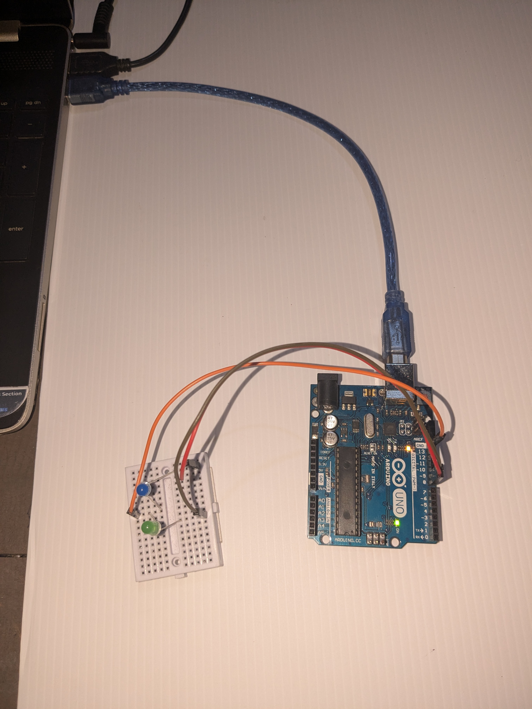

# Vehicle-Tracking-and-Counting-with-Real-Time-LED-Indicators

## Project Overview

The **"Real-Time Vehicle Tracking and Counting with LED Indicators"** system is designed to track and count vehicles entering and exiting a specified area in real-time. This project integrates computer vision techniques with hardware control, providing an efficient solution for traffic monitoring and management.

Using the **YOLO (You Only Look Once)** deep learning model, the system is capable of detecting multiple types of vehicles (such as cars, motorcycles, trucks, and buses) in a video feed. The detection is performed frame by frame, where each vehicle's movement is tracked across a predefined detection line. The system counts vehicles based on their movement direction, distinguishing between vehicles entering or exiting the monitored area.

Once the entry or exit of a vehicle is detected, **Arduino** is used to trigger corresponding **LED indicators**. An entry LED lights up when a vehicle enters the area, and an exit LED lights up when a vehicle exits. This real-time feedback system enhances user interaction and provides immediate visual confirmation of vehicle movement.

## Key Components

- **YOLO Model**: Real-time object detection and tracking.
- **OpenCV**: Video processing and object tracking.
- **Arduino**: Controlling the LEDs based on vehicle detection.
- **LED Indicators**: Visual feedback on entry and exit events.

## Features

- Real-time vehicle detection using the YOLO model.
- Accurate vehicle counting based on entry and exit direction.
- Integration with Arduino to trigger LEDs for entry and exit events.
- Can be extended to large-scale traffic management systems, toll booth monitoring, parking lot monitoring, and more.

## Requirements

- **Python 3.x**
- **OpenCV**: For video processing and tracking.
- **YOLOv4/v5 Model**: Pre-trained weights for vehicle detection.
- **Arduino IDE**: For programming the Arduino board.
- **Arduino Board (e.g., Arduino Uno)**: For controlling the LED indicators.
- **LED Lights**: For visual feedback.

## Results

### 📸 Image Output

### 🎥 Video Output  

Click on the image above to watch the project in action on **YouTube**.

